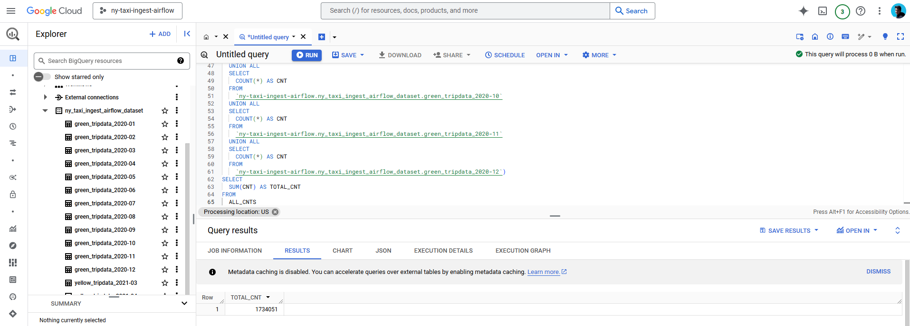
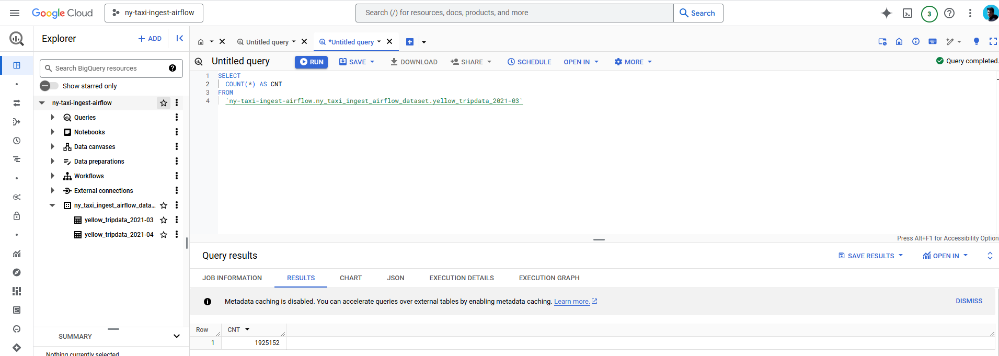

# DE Zoomcamp - cohort 2025
## Disclaimer: I did the data orchestration with Airflow

## Q1. Within the execution for Yellow Taxi data for the year 2020 and month 12: what is the uncompressed file size (i.e. the output file yellow_tripdata_2020-12.csv of the extract task)?

Answer: <mark> 128.3 MB </mark>

## Q2. What is the value of the variable file when the inputs taxi is set to green, year is set to 2020, and month is set to 04 during execution?

Answer: <mark> green_tripdata_2020-04.csv </mark>

## Q3. How many rows are there for the Yellow Taxi data for the year 2020?

Answer: <mark> 24,648,499 </mark>

## Q4. How many rows are there for the Green Taxi data for the year 2020?

Answer: <mark> 1,734,051 </mark>

## Q5. How many rows are there for the Yellow Taxi data for March 2021?

Answer: <mark> 1,925,152 </mark>

## Q6. How would you configure the timezone to New York in a Schedule trigger?

Answer: <mark> Add a timezone property set to America/New_York in the Schedule trigger configuration </mark>