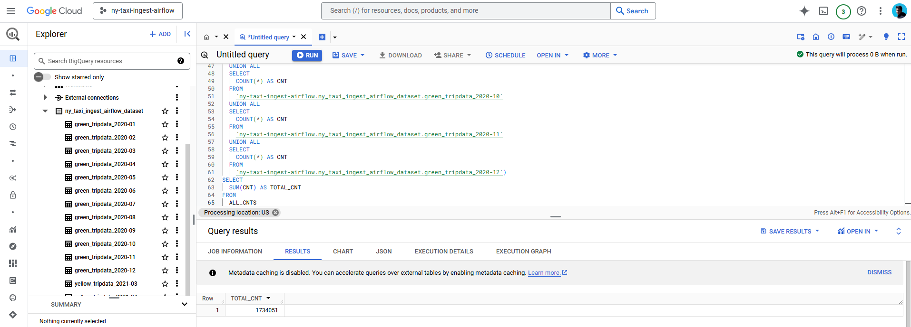

# Data Engineering ETL Project

This project implements an ETL (Extract, Transform, Load) pipeline primarily using Apache Airflow. The pipeline downloads data from online sources, processes it, and saves it to Google Cloud Storage (GCS) and BigQuery for further analysis.

## Key Features
- **Data Sources:** Downloads datasets from public online sources.
- **Data Processing:** Implements transformation and validation steps to ensure data quality.
- **Google Cloud Integration:**
  - Stores processed data in Google Cloud Storage.
  - Loads data into BigQuery for querying and analytics.
- **Automation:** Orchestrated using Apache Airflow to manage and schedule tasks.
- **Infrastructure as Code:** Uses Terraform to provision and manage GCP resources.

## Project Structure

```
project/
├── dags/                      # Airflow DAGs (pipelines)
│   ├── data_ingestion_gcs_dag.py
│   ├── ingest_ny_green_to_gcs.py
│   ├── ingest_ny_yellow_to_gcs.py
├── scripts/                   # Auxiliary scripts
│   └── entrypoint.sh
├── terraform/                 # Terraform configuration for GCP resources
│   ├── main.tf
│   ├── terraform.tfstate
│   ├── .terraform.lock.hcl
├── images/                    # Pipeline and data visualizations
│   ├── green_pipeline.PNG
│   ├── total_rows_green_2020.PNG
│   ├── total_rows_yellow_2021-03.PNG
├── docker-compose.yaml        # Docker Compose configuration for Airflow
├── Dockerfile                 # Dockerfile for Airflow environment
├── requirements.txt           # Python dependencies
├── .env                       # Environment variables (excluded in .gitignore)
└── useful_commands.txt        # Reference for useful commands
```

## Requirements

- Docker
- Docker Compose
- Google Cloud Platform account with access to BigQuery and GCS
- A Google Cloud credential (from Google Cloud Platform you can generate a .json credential for your project)
- Terraform

## Setup Instructions

1. **Clone the repository:**
   ```bash
   git clone <repository-url>
   cd project
   ```

2. **Set up environment variables:**
   Create a `.env` file with the necessary credentials and configurations. Example:
   ```env
   GOOGLE_APPLICATION_CREDENTIALS=/path/to/credentials.json
   PROJECT_ID=your-gcp-project-id
   BUCKET_NAME=your-gcs-bucket-name
   ```

3. **Build the Docker environment:**
   ```bash
   docker-compose up --build
   ```

4. **Initialize Terraform:**
   ```bash
   cd terraform
   terraform init
   terraform apply
   ```

5. **Access Airflow UI:**
   Open [http://localhost:8080](http://localhost:8080) in your browser to monitor DAGs.

6. **Trigger the pipeline:**
   Activate and run the DAGs from the Airflow UI.

## How It Works

1. **Extraction:** Downloads data from specified URLs.
2. **Transformation:** Processes and validates data using Python scripts within the Airflow DAGs.
3. **Loading:**
   - Uploads transformed data to GCS.
   - Loads data into BigQuery tables.

## Visualizations
Example images of the pipeline and data:
- **Pipeline Overview:** 
- **Row Counts:** 

## Notes
- Ensure the `.env` file and sensitive credentials are never pushed to the repository.
- Terraform state files may contain sensitive information; handle them carefully.

## Author
Guilherme Teixera Semissatto

